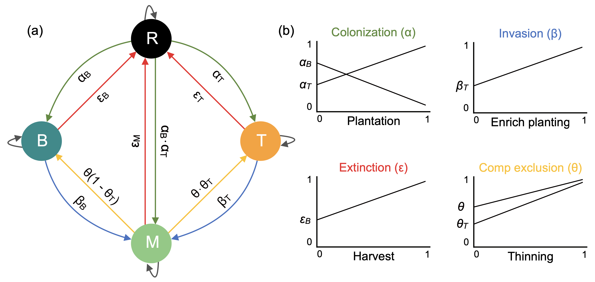
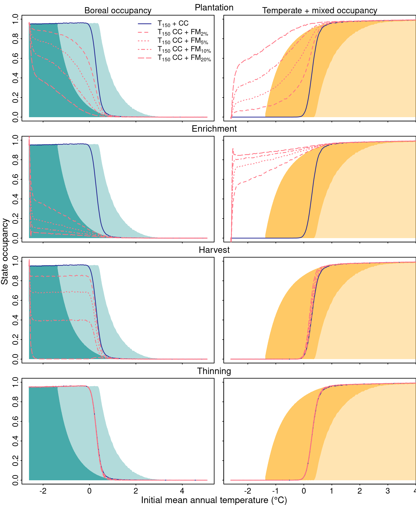

\newpage

# Introduction

***Forest dynamics under climate change***

There is a growing concern in how species will respond to climate change.
Correlative statistical models, which are based in the niche concept, have projected species' range to shift following warming temperature, and trees are expected to migrate hundreds of meters by the end of this century [@Malcolm2002; @Mckenney2007].
However, despite the observed shift of many species’ range following warming temperature [@Chen2011], many tree species have undergone no change [@Harsch2009; @Zhu2012].
For instance, trees of the eastern North America have shifted their range limits to fewer than 50% of the required to keep pace with warming temperature [@Sittaro2017].
This mismatch between climate conditions and forest composition leads us to anticipate maladaptation, and therefore a possible loss of forest productivity [@Aitken2008]
Quantify the mechanisms determining species range limits is critical to understanding species response to climate warming, and the potential actions to mitigate this perturbation [@Becknell2015].

Fast climate change has fostered the need to mechanistically understand the drivers of species’ range distribution as an effort to improve our projection abilities [@Evans2016].
Colonization and extinction are well-established mechanisms determining species’ range limits [@Levins1969; @Hanski1998; @Holt2000].
The metapopulation theory predicts species range limits to be defined as the moment colonization rate equals extinction rate, assuming habitat is available [@Holt2000].
Assuming colonization and extinction rate depend on temperature, it is expected, with climate warming, that species’ range limits will be relocated.
Range expansion depends on many processes such as dispersion capacity, establishment of propagules, survival, and growth until maturity [@Jackson2010; @Schurr2012].
On the other hand, excluding metapopulation dynamics [@Pulliam2000], range compression depends on species life-history trait and perturbation regimes that will define how individuals are persistent to local extinction [@Butterfield2019; @Schurr2012].
A failure on any of the above processes lead respectively to colonization credit, where locations are suitable but unoccupied [@Jackson2010; @Cristofoli2010], and extinction debt, where populations remain in unsuitable locations [@Kuussaari2009; @Tilman1994a].
Indeed, for trees that have slow demographic rates, the eastern North American trees are out of equilibrium with climate due to extinction debt at the trailing edge of the distribution, and colonization credit at the leading edge [@Talluto2017].

Integrating spatial constraints, demography and species interaction is of crucial importance to assess colonization credit and extinction debt.
It is well known that dispersal limitation will affect how species respond to environmental change [@Holt2005; @Scheller2008].
Trees naturally present low migration rates, and current land-use change through habitat loss and fragmentation will further contribute to reducing tress dispersion rates [@Collingham2000; @Malanson1996].
Furthermore, interspecific interactions such as competition can negatively affect demography and dispersal, and therefore reduce the potential range expansion of species [@Svenning2014].
On the other hand, for range compression, trees' growth rate will decrease in unsuitable habitats; but its extinction will depend on the species mortality rate [@Kuparinen2010] as well as the arrival of better competitors adapted to the new climate.
Furthermore, source-sink dynamics may contribute to the persistence of species in unsuitable habitats [@Pulliam2000].
Using a state and transition model for the eastern North American forest compositions, @Vissault2020 integrated slow demography of trees, species interaction and dispersal deficiency, and showed that the temperate-boreal ecotone will have minimal range shift following climate warming.
Such mechanistic models are ideal tools to explicit test the potential of management to mitigate the impact of climate change.

***Forest management***

Reduce colonization credit and extinction debt is an opportunity to help forest adapt by favoring the range shift of trees following climate warming [@Talluto2017].
Forest management, such as the well-known assisted migration [@Peters1985a], has been proposed as a potential tool in this direction [*e.g.* @Gray2011].
However, there has been extensive debate about its effectiveness [*e.g.* @McLachlan2007; @Vila2010; @Ricciardi2009; @Schwartz2009], with no “one size fits all” solution [@Hewitt2011;@Vila2010].
The truth is, temperature is warming and there is an increased need to adapt forest management practices under climate change [@Keenan2015; @Ameztegui2018].
Management practices can alter forest dynamics at different spatial scales, from local light gaps by selective logging, to larger areas by clearcutting.
Opening space at any spatial level may reduce extinction debt by removing species expected to go extinct, but also reduce colonization credit by creating available areas to be colonized [@Leithead2010; @Steenberg2013].
On the other hand, planting and enrichment planting of species or genotype in regions beyond its current range may reduce colonization credit.
Indeed, forest management can be adapted and optimized with small trade-offs between productivity and ecosystem services to enhance forest multifunctionality [@VanderPlas2018; @Trivino2017].

Before taking actions, however, we need a mechanistic understanding of the interaction between forest management and climate change [@Millar2007].
Empirical evidence testing the potential of forest management to adapt to climate change is limited, even for the highly discussed assisted migration [@Bucharova2017].
Modeling how management practices affect the mechanisms driving forest dynamics may improve our understanding about its effectiveness and orientate future experiments.
When modeling stand productivity of *Pinus sylvestris L.* under climate change, for instance, the use of thinning to reduce stand density between 20 and 40% was found to be optimal to maintain stand productivity [@Ameztegui2017].
Here we extend @Vissault2020’ model to integrate four simulated management practices to affect the colonization-extinction dynamics in an attempt to increase northward range shift.
To do so, for instance, plantation of temperate species is simulated by selecting random empty plots in the boreal region and transforming it in temperate plots.
Although the simplicity of the management practices, this approach captures the core result of managing at a broad spatial and temporal scale.
Quantify the effect of forest management on colonization and extinction mechanisms allows us to better assess the potential of management to help forest keep pace with climate change.

***Transient dynamic***

The potential of adaptive management has often been poorly accessed through indirect factors such as species richness.
The rationale is that increasing species diversity will increase the likelihood natural selection will keep the same services under uncertain climate changes [@Kolstrom2011].
However, given the slow response of forest ecosystems to environmental changes, forest adaptation to new climate conditions may last for a long period until reaches equilibrium.
Therefore, characterize the short-term dynamics rather than the long-term equilibrium is crucial to adaptive management as both happens at the same short time scale [@Hastings2004; @Svenning2013; @Ezard2010].
The short-term dynamics or the period a system at equilibrium takes to reach a new equilibrium after a disturbance is defined here as transient dynamics.
When analyzing the effect of harvest on the dynamics of the African tree *Khaya senegalensis*, for instance, the transient dynamics revealed an effect not captured when only analysis the long-term dynamics [@Gaoue2016].
Transient dynamics, especially for long-lived species, can provide insights on how management can help species keep pace with climate change.

***The challenge***

In an attempt to help forest keep pace with climate change, here we test the potential of forest management to increase northward range shift of the temperate-boreal ecotone following warming temperature.
We use a model based in the metapopulation theory and parametrized for the eastern North American trees [@Vissault2020] that decompose forest dynamics in colonization-extinction processes.
We measure the effect of reducing colonization credit through plantation and enrichment planting, and reducing extinction debt through harvest and thinning using two different approaches.
First, we perturb the system at equilibrium with warming temperature and characterize its recovery to the new equilibrium through five metrics of the transient dynamic: (i) initial resilience or the reactivity of the system after warming temperature; (ii) local resilience or the rate in which the system recovery to equilibrium; (iii) exposure or the shift of forest states to the new equilibrium; (iv) sensitivity or the time for the state reach equilibrium after warming temperature and (v) vulnerability or the cumulative amount of state changes after warming temperature.
We hypothesize that reducing colonization credit and extinction debt will reduce the transient period until forests reach its new equilibrium.
Second, we spatially-explicit the first approach to account for deficient migration of trees and stochastic dynamics, and predict how the range limits of the temperate-boreal ecotone will shift in the next 150 years.
We hypothesize that reducing colonization credit and extinction debt will increase the northward range shift of the temperate-boreal ecotone.

![Conceptual hypothesis. The left panel is the result of the forest states at equilibrium with climate extracted from the State and Transition Model parametrized for the North American forest. In this panel we can see how boreal trailing edge and temperate/mixed leading edge are expected to shift northward after climate change (CC). The left panel of the hypothesis 1 box shows the five metrics to characterize the transient dynamics of a system after perturbation: initial resilience ($-R_0$), asymptotic resilience ($R_{\infty}$), exposure ($\Delta_{state}$), sensitivity ($\Delta_{time}$) and  cumulative amount of changes ($\int S(t)dt$). Our first question is how forest management will affect these five metrics and our hypothesis is described in the right panel. On the hypothesis 2 box we show the first (before CC) and last (after CC) landscape of a simulation using the spatially-explicit version of the model. The bars limit the trailing edge of boreal and the leading edge of temperate states. We question if forest management can increase the northward shift of the boreal trailing edge which is lagging behind CC. Our hypothesis is that forest management will increase the northward shift and smooth the transition between boreal and mixed states.](img/concept.png){#fig:concept}

# Methods

## State and Transition Model with forest management

We used a State and Transition Model parameterized for the eastern North American forest [@Vissault2020], in which we integrated four practices of forest management to test their impact in the response of forest states to climate change.
The model has four states defined by succession and species composition: (R)egeneration, (T)emperate, (M)ixed and (B)oreal (Figure \@ref(fig:model)).
The transition probabilities between states are defined by four ecological processes.
Succession ($\alpha$) promotes the transition from regeneration state to either boreal, mixed or temperate; the opposite process is disturbance ($\varepsilon$), increasing the transition of matures states to regeneration.
Colonization ($\beta$) of either boreal or temperate species in the opposite state promotes the transition to mixed state.
Competitive exclusion ($\theta$ and $\theta_{T}$) between boreal and temperate species increases the probability of mixed stands become either boreal or temperate.
Disturbance ($\varepsilon$) of boreal, temperate or mixed promotes the transition to the regeneration state.
The first two processes ($\alpha$ and $\beta$) and the last two ($\theta$ and $\varepsilon$) are grouped in the colonization-extinction mechanisms of the metapopulation theory, respectively.
The probability of each of these processes is calculated based in temperature, precipitation and the states neighbors' proportion.
Details in the classification of the four states and parameterization of the model using data from the eastern North American forest inventory can be found in @Vissault2020.
Plantation, harvest, thinning and enrichment planting are the four practices of forest management implemented in the model.
The rationale of these four management practices is to favor the spread of the temperate forest when the climate context allows temperate tree regeneration.
The following sections details how each practice is implemented in the model.

{#fig:model}

### Plantation of temperate stands
Succession from regeneration stands to either boreal, mixed or temperate is a function of the capacity of boreal and temperate species to establish ($\alpha_B$ and $\alpha_T$), and the proportion of neighboring stands.
Plantation practice increases the probability of regeneration stands to become temperate $P(T|R)$.
It gets a proportion of available regeneration stands, and convert it to temperate, reducing then the probability that regeneration stands become either boreal or mixed.
This proportion of regeneration stands is not available anymore for natural succession.
Plantation thus involves an additional parameter $p$ that modifies the following probabilities:
$$
\begin{aligned}
  P(T|R) &= [\alpha_T (T+M) \times (1-\alpha_B (B+M))] \times (1 - p) +  p \\
  P(B|R) &= [\alpha_B (B+M) \times (1-\alpha_T (T+M))] \times (1 - p) \\
  P(M|R) &= [\alpha_T (T+M) \times \alpha_B (B+M)] \times (1 - p)
\end{aligned}
$$

where $p$ is the proportion of R stands that are planted per time step. Note that when $p=0$, the natural dynamic occurs and when $p=1$, $P(T|R)=1$,  $P(B|R)=P(M|R)=0$.

### Harvest of boreal stands

The perturbation of boreal stands to regeneration is a function of extreme events ($\varepsilon$).
Harvest practice increases the probability of boreal stands to become regeneration $P(R|B)$.
It gets a proportion of boreal stands that were not disturbed, and convert it in regeneration stands by cutting all trees.
Harvest thus involves an additional parameter $h$ that modifies the following probabilities:
$$
\begin{aligned}
  P(R|B) &= [\varepsilon \times (1 - h)] + h \\
  P(M|B) &= (1- (\varepsilon \times (1 - h) + h)) \times \beta_T(T + M)
\end{aligned}
$$

Where $h$ is the proportion of boreal stands that are harvested at each time step. If $h=1$, no boreal stands will be maintained, and when $h=0$, the natural disturbance occurs.

### Enrichment planting

Colonization (invasion) of temperate species on boreal stands is a function of the capacity of temperate species to colonize $\beta_T$, and the proportion of neighboring stands of mixed and temperate. This only applies to stands that are neither disturbed nor harvested: $P(M|B) = \beta_T(T + M)(1- (\varepsilon \times (1 - h) + h))$.
Enrichment planting of temperate species on boreal stands increases the probability of boreal stands to become mixed.
It gets a proportion of boreal stands available to colonization, and convert it in mixed stands by planting temperate trees.
The colonization probability of temperate species on boreal stands after enrichment planting adds a parameter $e$ to the model:
$$
P(M|B) = [(1- (\varepsilon \times (1 - h) + h)) \times \beta_T(T + M)] \times (1-e) + e
$$

Where $e$ is the proportion of available boreal stands (*i.e.*, neither disturbed nor harvested) that are enriched at each time step. When $e=0$, the natural dynamic occurs, when $e=1$, $P(M|B)= 1- (\varepsilon \times (1 - h) + h)$.

### Thinning of boreal trees in mixed stands
The exclusion of boreal trees by temperate trees in mixed stands is a function of instability of the mixed stand $\theta$ and the ration of competitive ability between temperate and boreal species, $\theta_T$.
Thinning of boreal species in mixed stands can increase the probability of mixed stands to become temperate by two different ways.

First, thinning of boreal species should decrease the stability of the mixed stand ($P(M|M) = 1-\theta$), thus increase $\theta$:

$$
  \theta_{m} = [\theta \times (1 - s1)] + s1
$$

Second, thinning of boreal species should increase the ability of temperate species to exclude boreal ones by competition:

$$
\theta_{T, m} = [\theta_{T} \times (1 - s2)] + s2
$$

It is unclear if we need to distinguish between the two parameters. The rationale is that the proportion $s1$ of mixed stands that are managed this way are directly converted into temperate. It means that $s2$ should at least be equal to $s1$. $s2$ can be greater than $s1$ if thinning further boost the competitively (fitness) of temperate species. For a parsimonious approach, it seems reasonable to set $s1=s2$. These modifications directly affect $P(T|M)$ and $P(B|M)$:

$$
\begin{aligned}
  P(T|M) &= \theta_m \times \theta_{T,m} \times (1 - \varepsilon) \\
  P(B|M) &= \theta_m (1 - \theta_{T,m}) \times (1 - \varepsilon)
\end{aligned}
$$

Where $s$ is the proportion of mixed stands that are available (not disturbed) and where thinning is applied, per time step. When $s=1$, $P(T|M) = 1$ and $P(B|M) = 0$.

## Analysis of the transient dynamics after warming temperature

To test our first hypothesis, using the spatially-implicit version of the model at the equilibrium with current climate conditions, we applied warming temperature and concentrated in the transient dynamics of the four forest states over time until they reach the new steady state.
We measured the transient dynamics over a latitudinal gradient of annual mean temperature ranging from -2.61 to 5.07$^{\circ}$C, representing the ecotone gradient from boreal dominant species to a temperate dominant composition.
While temperature varied, annual mean precipitation was fixed to 998.7 mm as precipitation has relatively small effects on the model compared to temperature.
For each initial temperature condition (*i.e.* latitude position), temperature increased of 0.09 $^{\circ}$C at each time step for the first 20 steps (100 years; RCP4.5), and then remained constant until the model reached the steady state.

We characterized the transient phase after warming temperature for each latitude position using five different metrics.
These metrics allow us to mechanistically understand the transient phase and test the effect of forest management in each of these metrics.
We used asymptotic and initial resilience as measures of local stability [@Arnoldi2016].
The asymptotic resilience ($R_{\infty}$) quantifies the asymptotic rate of return to equilibrium after small perturbation.
The more negative $R_{\infty}$, the greater asymptotic resilience.
Initial resilience ($-R_0$) describes the response of initial equilibrium to warming temperature.
Positive values of $-R_0$ indicate smoothly transition to the new equilibrium whether negative values indicate reactivity, i.e. an initial amplification against final equilibrium.
The exposure of the ecosystem states ($\Delta_{state}$) is defined by the difference in state proportion between pre- and post-temperature warming [@Dawson2011].
The return time ($\Delta_{time}$) or ecosystem sensitivity is the length of steps of the transitory phase, where each time step of the model is equal to 5 years.
Finally, the cumulative amount of changes of the transitory phase, or ecosystem vulnerability [@Boulangeat2018], is defined as the integrated measure of all changes in the states after temperature warming, and is obtained by the integral of the states change over time ($\int S(t)dt$).

## Analysis of the spatial dynamic after warming temperature

To test the second hypothesis, we spatially-explicit the model with a theoretical landscape (lattice) to account for explicit migration and stochastic dynamics.
The latitudinal gradient of the landscape is defined using the same annual mean temperature range of the spatially-implicit model (-2.61 to 5.07$^{\circ}$C) to capture the whole ecotone from boreal to temperate dominant species, with constant annual mean precipitation of 998.7 mm.
The prevalence probability of each cell of the lattice at time $t + 1$ was calculated considering the eight neighbors' cells and the temperature and precipitation condition of the cell at time $t$.
The state of the current cell at time $t + 1$ is then defined in function of the multinomial distribution of the prevalence probability.
The impact of warming temperature in the landscape dynamics is included by increasing temperature of 0.09 $^{\circ}$C for each cell at each time step for the first 20 steps (100 years; RCP4.5).

We ran multiple simulations to compare the relative importance of warming temperature, forest management practices, and the interaction between the two with the equilibrium distribution for future climate conditions.
The simulations where ran for 150 years (i) without climate change nor forest management, (ii) only climate change, (iii) only one practice of forest management, and (iv) climate change and forest management.
These four simulations were then compared with current ($T_0$) and future ($T_1$) forest distribution at equilibrium.
For each simulation, we measured the boreal and the mixed + temperate relative occupancy over the latitudinal gradient of mean annual temperature.

# Results

## Effect of Forest Management on Transient Dynamics After Climate Change

We described the transient dynamics after warming temperature over the latitudinal gradient of annual mean temperature for five different scenarios: natural dynamics without forest management, 0.25% of plantation, 0.25% of enrichment planting, 1% of harvest and 0.25% of thinning (Figure \@ref(fig:num-res1)). Plantation and enrichment planting, which simulate the payment of colonization credit, were the only two practices affecting the transient dynamics after warming temperature. When the system at equilibrium was perturbed with warming temperature, enrichment planting increased the shift of forest states to a new equilibrium in the boreal region (figure 1a). Plantation and enrichment planting reduced by about 40 and 80% of the time for forest reaches the new equilibrium after warming temperature, respectively (fig 1c). The cumulative state changes (fig 1e) resume the changes in both exposure and sensitivity. Forest management reduced considerably the cumulative state changes in the boreal/mixed region by reducing the time to reach the new equilibrium, and slightly increased cumulative state changes in the boreal region by increasing the shift of forest states to a new equilibrium. In both boreal/mixed and mixed/temperate transition regions, asymptotic resilience were close to zero (weak resilience to perturbations) and initial resilience greater than zero (smooth response to perturbations). Enrichment planting altered both resilience metrics only in the boreal/mixed transition region, where asymptotic resilience was increased (fig 1b) and initial resilience reduced (fig 1d). Reducing colonization credit through plantation and enrichment planting were effective in changing the transient dynamics after warming temperature in the boreal/mixed transition region, helping forest keep pace with climate change.

![The transient dynamics after warming temperature over the latitudinal gradient of annual mean temperature for five different scenarios: natural dynamics without forest management, 0.25% of plantation, 0.25% of enrichment planting, 1% of harvest and 0.25% of thinning. Transient dynamics is described by (a) exposure or the shift of forest states to the new equilibrium; (b) asymptotic resilience or the rate in which the system recovery to equilibrium; (c) sensitivity or the time for the state reach equilibrium after warming temperature; (d) initial resilience or the reactivity of the system after warming temperature and (e) vulnerability or the cumulative amount of state changes after warming temperature.(f) The expected occupancy of boreal and mixed + temperate states at equilibrium with climate before ($T_0$) and after ($T_1$) warming temperature.](img/num-result.png){#fig:num-res1}

We fixed the environment condition for both the boreal and the boreal/mixed transition region, and tested how increasing forest management intensity alter the transient dynamics after warming temperature (figure \@ref(fig:num-res2)). For the sake of simplicity, initial resilience and cumulative state changes are omitted in the figure \@ref(fig:num-res2), and can be found in the supporting information (SI Figure S\@ref(fig:sim-result-supp1)). By increasing management intensity, all management practices altered the transient dynamics after warming temperature, and some management practices presented non-linear response. Overall, increasing plantation and enrichment planting intensity increased exposure and asymptotic resilience and reduced sensitivity at both spatial regions. Harvest also increased exposure, but reduced asymptotic resilience and increased sensitivity. Surprisingly, thinning had a negative effect reducing asymptotic resilience and increasing sensitivity at the boreal/mixed transition region. Increasing management intensity can accelerate forest response to climate change by reducing colonization credit, but can delay this response by reducing extinction debt.

{#fig:num-res2}

## Effect of Forest Management on Range Limits Shift Under Climate Change

Using the spatially explicit model accounting for deficient migration of trees and stochastic dynamics, we tested how forest management affect the range limit shift of the boreal trailing edge and the temperate+mixed leading edge (figure \@ref(fig:sim-result)). We show how the occupancy of boreal and temperate states over the latitudinal gradient of annual mean temperature change from the current landscape configuration ($T_0$) to: 150 years later without climate change neither forest management ($T_{150}$); with only warming temperature ($T_{150} + CC$); with only forest management ($T_{150} + FM$); and both warming temperature and forest management interacting ($T_{150} + CC + FM$). After 150 years with the same conditions ($T_{150}$) or only forest management ($T_{150}$ + FM), both the boreal trailing edge and the temperate leading edge slightly shifted southwards. After 150 years with temperature warming in the first 100 years (RCP 4.5), both the boreal and temperate range limit shifted northward. However, boreal receded to a certain extent, and created a critical transition between boreal and mixed/temperate states ($T_{150} + CC$). Finally, with both warming temperature and forest management interacting, enrichment planting increased both the boreal and the temperate northward shift. Reducing colonization credit, through enrichment planting, increased the northward shift of forest states only when interacting with climate change, creating a smooth transition from boreal to mixed state.

![Boreal (left panels) and temperate plus mixed (right panels) occupancy along the latitudinal gradient of the boreal/temperate ecotone. Each line is a different simulation to differentiate the isolated and interacting effect of climate change (CC) and forest management (FM). $T_0$ is the initial landscape, $T_150$ the last landscape after 150 years, $T_150 + CC$ with climate change, $T_150 + FM$ with forest management and $T_150 + CC + FM$ with climate change and forest management interacting. The results are the mean of 15 replications. For the sake of simplicity, the confidence interval is omitted as we found little variation between replicates. Management intensity was set to 0.25% for plantation, thinning and enrichment planting, and 1% for harvest. Climate change scenario was the RCP 4.5.](img/sim-result.png){#fig:sim-result}

As simulation time and management intensity of figure \@ref(fig:sim-result) were small for the sake of reality, we further tested how increasing management intensity and time of simulation will affect range limits shift of boreal and temperate stands.
Increasing simulation time of up to 1000 years, both boreal and temperate range limits took around 1000 years to reach the expected equilibrium by reducing colonization credit with 0.25% of plantation and enrichment planting (SI Figure S\@ref(fig:sim-result-supp3)).
Increasing management intensity of up to 20% per year, plantation and enrichment planting increased northward range limits shift linearly, and overpassed the expected equilibrium (SI figure S\@ref(fig:sim-result-supp2)). Harvest reduced the proportion of boreal and increased the proportion of regeneration state, but did not break the critical transition between boreal and mixed states. Thinning increased the transition from mixed to temperate stands, but did not have any effect on range limits shift.

# Discussion

There is an increasing need to investigate how forest biomes will respond to warming temperature, and how forest management can mitigate the negative impacts of this perturbation.
Our study reveals that paying the colonization credit by planting and enrichment planting are likely to (i) reduce the period of transient dynamics after warming temperature, and (ii) increase range limits shift at global scale.
These results based in two complementary approaches, reinforce the potential of forest management to help the boreal/temperate ecotone keep pace with climate change.
Furthermore, our theoretical approach supported by long-term data is crucial to help future experiments test the potential of forest management to adapt to climate change, as well as guide future managers to take account of both natural and anthropogenic perturbation on forest dynamics.

***Plantation and enrichment planting reduce the transient dynamics and increases northward range shift***

Although climate change is expected to drive a shift in forest composition by favoring temperate over boreal trees, the temperate-boreal ecotone is lagging behind climate change [@Talluto2017; @Vissault2020].
Our results support the hypothesis that plantation and enrichment planting of temperate species on the boreal region can reduce this lag by reducing the period at the transient dynamics and increasing the boreal northward range shift.
To date few empirical studies have tested how assisted migration increase northward range shift of trees; rather indirect indicators such as resilience have been used.
For instance, planting tree species more suitable to future climate is predicted to increase resilience indicators such as carbon stocks and tree species diversity [@Hof2017], and therefore it is assumed to increase range shift under climate change.
Using the same rational, planting climate suitable species increased both biomass productivity and species diversity in multiple scenarios of climate change [@Duveneck2015].
In the transient dynamic, we found a small increase in asymptotic resilience when applying enrichment planting in the boreal-mixed transition region (Figure \@ref(fig:num-res1)).
When explicitly assessing resistance and resilience through species composition change over time, forest management had limited ability to increase these indicators in the face of climate change [@Duveneck2016].

***Why the enrichment planting practice is stronger than planting?***

Enrichment planting had a stronger effect to reduce the transient period and increase the retraction of the boreal trailing edge when compared with planting.
First, the intensity of forest management in the model is relative to the state abundance; hence 0.25% of boreal stands being enriched is much higher than 0.25% of empty stands being planted.
That explains the need to increase planting intensity beyond 0.25% to increase boreal northward range shift (Supp fig SI3).
Furthermore, the number of transitions to reach the expected state at equilibrium with climate depends on the management practice; enrichment planting needs only one transition (B -> M) while planting needs two (R -> T -> M).
These results suggest that enrichment planting have the best potential of the four management practices to help forest keep pace with climate change.
However, enrichment planting alone may not be possible.
For instance, partial logging and the presence of canopy gaps, were more effective to tree recruitment than clearcut in northern temperate forests [@LePage2000].
Furthermore, canopy gaps in mixed forests facilitate the establishment of temperate species [@Leithead2010].
These results suggest that before enrichment planting temperate species beyond its range limits, thinning the stand to create gaps may be required.

***Why reducing colonization credit increase range shift but reducing extinction debt don't?***

Reduce extinction debt by increasing the frequency of disturbance (natural or anthropogenic) can drive range shift by eliminating maladapted species that would persist for a long period, and then create colonization opportunities for advancing species [@Renwick2015; @Kuparinen2010].
For instance, moderate disturbance amplified shift composition to warm-adapted species in the boreal-temperate ecotone of Quebec [@Brice2019].
Here intensifying disturbance by increasing harvest of boreal stands did not affect the rate of northward range shift after warming temperature.
This result corroborates with @Vanderwel2014 in which harvest of boreal species amplifies transitions to early-successional forest type, and have no effect on the range shift of boreal conifers.
This may be explained by source-sink dynamics that, despite the reduction in habitat quality due to warming temperature, and the increase in the extinction rate of patches due to harvest, increases the likelihood the extinct patch returns to its previous state.
This likelihood is reduced if there is a demographic limit in the persistent species (*e.g.* physiological responses @Reich2015), and further intensified if species better adapted to the new climate arrive (*e.g.* plantation), in which competitive exclusion will eliminate the less adapted species.

***Thinning increase temperate expansion, but do not affect boreal retraction***

We tested the hypothesis that selective harvesting boreal species (thinning) on the mixed region would increase the proportion of temperate species, and therefore increase the regional pool to favor the colonization of temperate on the boreal region.
Thinning indeed increased the proportion of temperate stands on the mixed region, but did not have any effect on the boreal retraction.
The expansion of the temperate range limits corroborates with literature, where harvest has increased temperate species in the mixed region of Quebec [@Boulanger2019].
The lack of temperate colonization on the boreal region may suggest that other factors (*e.g.* soil as discussed below) not considered in the model are limiting temperate expansion.
Another possibility is that thinning may be more efficient when applied in the boreal region, opening gaps for the colonization of temperate species.
For instance, regeneration of temperate species such as red maple and red oak shown to be facilitated in gaps, while boreal species showed no difference [@Leithead2010].

***Limitations and future perspectives***

We have argued that plantation and enrichment planting have the potential to reduce colonization credit and therefore help forest keep pace with climate change.
However, further experiments are necessary as the four simulated practices in our study are an approximation with real management practices.
For instance, here we simulated thinning as selective logging boreal species in favor of temperate, while the current use of thinning is usually to reduce stand density.
Furthermore, there is a mismatch between our simulations at the community stand with the management practices that occur at the population level.
Aware of that, we call for studies taking account of forest dynamics at other organizational scales.
Demographic models are useful to predict local mechanisms such as species interaction scale up to determining species range limits at the metapopulation level [@Araujo2014; @Normand2014].
However, these models are limited in the literature when compared with models at the metapopulation level [@Hylander2013].
In our context, demographic models can test the effect of forest management in the growth, mortality and regeneration processes, and help better understanding how the effect of management practices scales up to a larger spatial scale.
Another limitation of our study is related to the climate change scenario.
It is predicted that drought intensity will increase with climate change, and may drive how forest will respond to climate change.
However, we simulated warming temperature, while precipitation remained constant.
Although some studies have shown tree species to be more sensitive to increase in drought rather than temperature [*e.g.* white spruce @Andalo2005], we assumed constant precipitation as our model had low sensitivity to precipitation levels compared to temperature.
Moreover, we call for studies testing other biotic and abiotic factors driving the colonization-extinction processes of forest dynamics.
For instance, the establishment of temperate trees was more limited by soil types than dispersion limitations [@Caspersen2005].
Finally, we propose future studies should focus on the interaction between the management practices, and how the spatial distribution of these practices alter range limit shift.

\newpage

# References

\newpage

# Appendix

{#fig:sim-result-supp1 width=80%}

{#fig:sim-result-supp2}

{#fig:sim-result-supp3}
